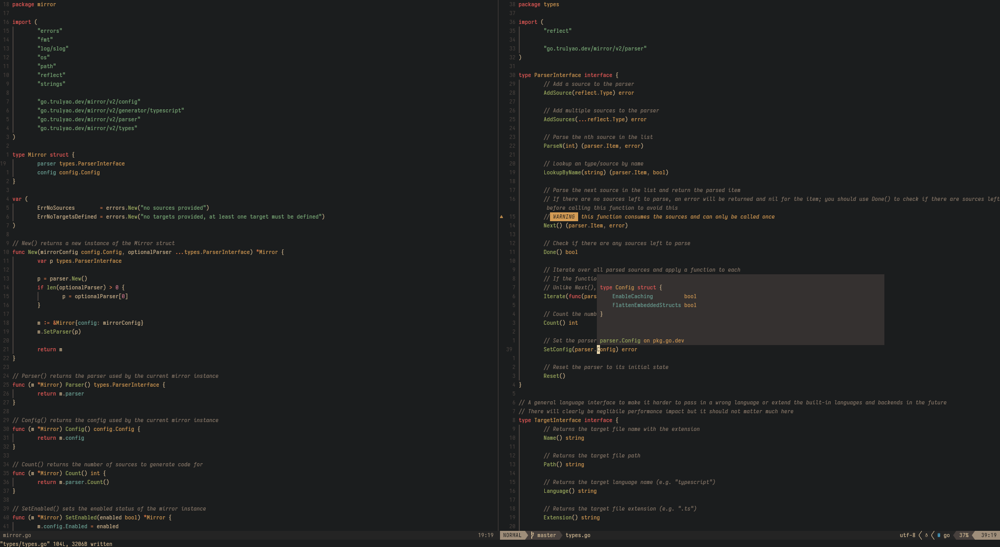

This config does not have a lot of stuff you may want but it is functional for me and I use it almost everyday. I work directly on a remote server at work with certain limitations (permissions-related mostly), so I had to craft this config from scratch.

# Highlights

- Telescope with "find file" only (you may have to install `ripgrep`)
- Some LSP features like rename symbol, code actions, goto definition, show hover documentation etc
- Diagnostics (+ Trouble support)
- No file tree (by choice; I find `telescope` and `egrep` enough)
- Tabs and panes support
- Session auto-save and auto-restore (saves panes, tabs and cursor positions based on git branches; this is SUPER useful)
- Autoformatting is disabled by default (for... reasons)
- Which-key, comment (`<leader>/`) and treesitter

It has just enough to be usable for me day-to-day for the things I do which is fine, the keymaps almost mirror my personal setup [here](https://github.com/aosasona/personal.nvim) but you may want to extend this setup significantly to make it usable for your own workflow.
